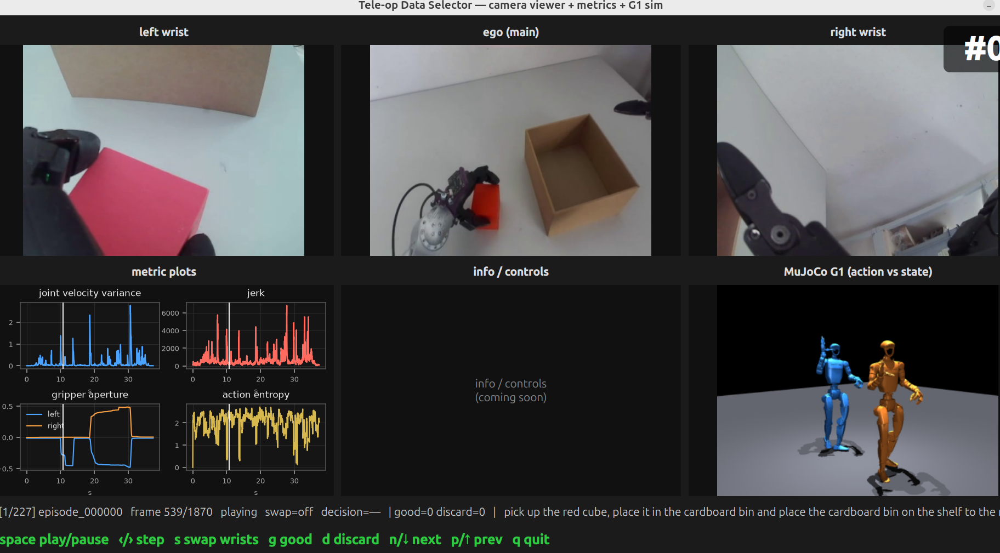
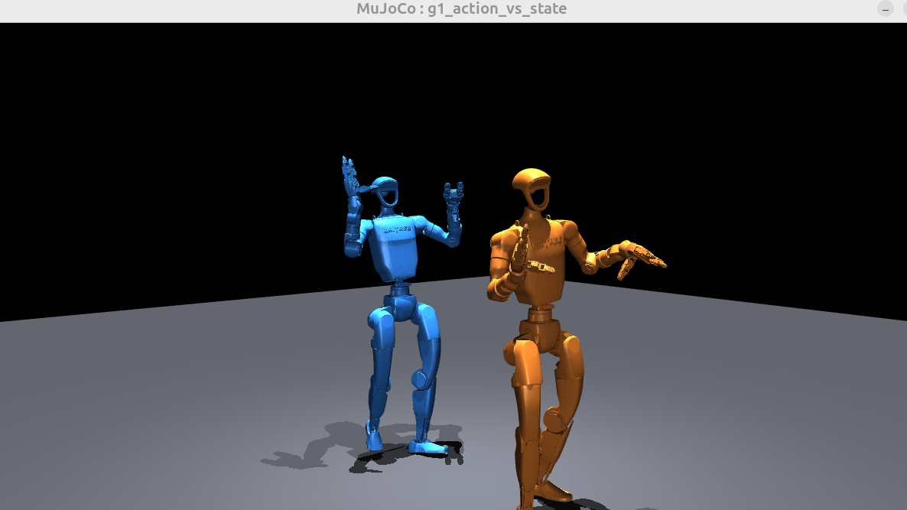
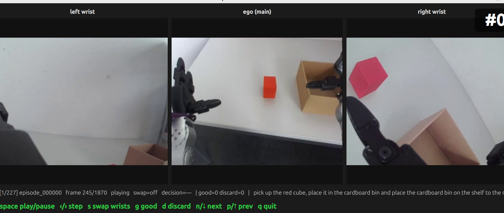

# Tele-op Data Analyzer

Tools to triage and analyze Unitree **G1** teleoperation demonstrations collected
with GR00T **Sonic** whole-body control. See [`plan.md`](plan.md) for the full
design.

This README covers the **review GUI** (`teleop_data_selector_gui.py`: three
cameras + metric plots + an embedded MuJoCo G1 replay), the batch **metric
plotting CLI** (`teleop_data_analyzer_plotting.py`), and the standalone
**G1 action viewer** (`view_g1_action.py`).



---

## Quick start

**Requirements:** Python ≥ 3.10, a display (the tools open windows), and — for
the MuJoCo panes — working OpenGL. Python deps are pinned in
[`requirements.txt`](requirements.txt): `numpy`, `pandas`, `pyarrow`,
`matplotlib`, `PySide6`, `opencv-python-headless`, `mujoco`, `huggingface_hub`.

```bash
# 1. Create the .venv, install requirements.txt, and download the sample dataset
./install.sh
#    Variants:  SKIP_DATASET=1 ./install.sh   (deps only)
#               DATA_DIR=/path  ./install.sh   (dataset elsewhere)

# 2. Download the G1 MuJoCo model + meshes (~38 MB) into models/
./scripts/fetch_g1_model.sh

# 3. Activate the environment
source .venv/bin/activate
```

Then run the tools (commands and options below):

```bash
# Review GUI — 3 cameras + metric plots + synced MuJoCo G1 replay
python -m teleop_data_analyzer.teleop_data_selector_gui \
    --dataset-root data/red_cube_cardbox_all_cleaned_01

# Camera viewer + metric plots only (no MuJoCo pane)
python -m teleop_data_analyzer.teleop_data_selector_gui \
    --dataset-root data/red_cube_cardbox_all_cleaned_01 --no-sim

# Camera feeds only — no metrics, no MuJoCo (fastest, stutter-free)
python -m teleop_data_analyzer.teleop_data_selector_gui \
    --dataset-root data/red_cube_cardbox_all_cleaned_01 --cameras-only

# Metric overview across all episodes
python -m teleop_data_analyzer.teleop_data_analyzer_plotting \
    --dataset-root data/red_cube_cardbox_all_cleaned_01

# Standalone MuJoCo action viewer (one episode, interactive 3D)
python -m teleop_data_analyzer.view_g1_action \
    --dataset-root data/red_cube_cardbox_all_cleaned_01 --episode 0
#with --hide-ui to hide MuJoCo's side panels for a clean robots-only window
```

> The model and dataset are git-ignored; steps 1–2 fetch them. If `mujoco` or
> the G1 model is missing, the review GUI still runs as a pure camera viewer and
> the MuJoCo pane shows why it's empty.

---

## Review GUI — `teleop_data_selector_gui.py`

The triage tool. Top row shows the three per-episode camera feeds
(left wrist | ego/main | right wrist); the bottom-left pane shows four
quality metrics with a synced playhead; the bottom-right pane is the MuJoCo
G1 replay, rendered offscreen and **kept in sync with the camera playhead**.
The bottom-middle info / controls pane is still reserved.

```bash
python -m teleop_data_analyzer.teleop_data_selector_gui \
    --dataset-root data/red_cube_cardbox_all_cleaned_01
```

**Options**

| Flag | Default | Meaning |
|---|---|---|
| `--dataset-root PATH` | a local sample path | LeRobot dataset root to review |
| `--no-sim` | off | disable the MuJoCo pane (metric plots still shown) |
| `--cameras-only` | off | show only the three camera feeds; skip metrics and MuJoCo entirely (fastest, no parquet load) |
| `--sim-base {upright,orientation}` | `upright` | pelvis pinned upright, or apply recorded base orientation (relative to frame 0) in the sim pane |
| `--quat-order {wxyz,xyzw}` | `wxyz` | quaternion order of `observation.root_orientation` (use `xyzw` if the lean looks wrong) |

**Keys** (focus the window): `space` play/pause · `←`/`→` step frame ·
`s` swap wrists · `g` good · `d` discard · `n`/`p` next/prev episode · `q` quit.
Decisions are saved non-destructively to `decisions.json` in the dataset root.

---

## Metric plotting CLI — `teleop_data_analyzer_plotting.py`

Computes the shared metrics from `metrics.py` without launching the Qt GUI. In
default mode it iterates every episode and opens two figures: a 2x2 overlay with
thin per-episode lines plus mean +/- std bands, and a per-episode summary view
for outlier spotting.

```bash
python -m teleop_data_analyzer.teleop_data_analyzer_plotting \
    --dataset-root data/red_cube_cardbox_all_cleaned_01
```

Use `--episode N` for the same 2x2 per-episode layout as the GUI with an
interactive playhead slider. Use `--save PATH` to write PNG figure(s) instead of
showing windows. Entropy parameters are configurable with `--entropy-window` and
`--entropy-bins`.

---

## G1 action viewer

Replays a recorded episode on the G1 in MuJoCo so you can *see what the recorded
action does with the robot*. Two robots are shown side by side:

- **blue (left)** — `action.wbc`, the whole-body-control **target** joint
  positions (the *command*),
- **orange (right)** — `observation.state`, the **measured** joint positions
  (what the robot *actually did*).

Comparing them shows the controller's tracking — where the action and the
realized motion diverge.



### Setup

See [Quick start](#quick-start) above (`./install.sh` +
`./scripts/fetch_g1_model.sh`). `fetch_g1_model.sh` pulls
`unitree_g1/g1_with_hands.xml` from
[mujoco_menagerie](https://github.com/google-deepmind/mujoco_menagerie) into
`models/`. That model has the **exact same 43 joint names** as the dataset, so
the replay maps joints purely by name (no hand-built index table).

### Run

```bash
python -m teleop_data_analyzer.view_g1_action \
    --dataset-root data/red_cube_cardbox_all_cleaned_01 \
    --episode 0
```

**Options**

| Flag | Default | Meaning |
|---|---|---|
| `--dataset-root PATH` | (required) | LeRobot dataset root |
| `--episode N` | `0` | episode index to replay |
| `--speed X` | `1.0` | initial playback speed |
| `--base {upright,orientation}` | `upright` | pin pelvis upright, or apply recorded base orientation |
| `--quat-order {wxyz,xyzw}` | `wxyz` | quaternion order of `observation.root_orientation` |
| `--hide-ui` | off | hide MuJoCo's side panels for a clean robots-only window |

### Controls (focus the MuJoCo window)

| Key | Action |
|---|---|
| `space` | play / pause |
| `→` / `←` | step one frame (when paused) |
| `↑` / `↓` | speed ×2 / ÷2 |
| `o` | toggle base orientation (recorded ↔ upright) |
| `r` | restart episode |
| mouse | orbit / pan / zoom (MuJoCo's own controls) |

The MuJoCo side panels are shown by default (use the right panel's camera
controls / mouse to set the view). Pass `--hide-ui` for a clean robots-only
window.



### Default camera

The viewer opens with this free-camera pose, set in `default_camera` /
`vis.global_.fovy` in `sim/g1_scene.py`:

| Setting | Value |
|---|---|
| field of view (`fovy`) | 42° |
| look-at | `(0, 0, 0.8)` |
| azimuth | 140° |
| elevation | −8° |
| distance | 3.0 m |

To retune: mouse-orbit to the view you want, read the values off the right
panel, and edit `default_camera` (and `fovy`) in `sim/g1_scene.py`.

---

## ⚠️ Important: what the replay can and cannot show

The viewer is a **kinematic replay** (a puppet): each frame the recorded joint
angles are written straight into the model and forward kinematics is run. There
is **no physics** — no gravity, no contact, no stepping. This is deliberate, and
it has two consequences worth understanding.

**1. Manipulation and articulation are faithful.** The arms, hands (Dex3
fingers), legs, waist and head reproduce the recorded motion exactly, because
every one of the 43 joints is driven directly from the data.

**2. The robot does NOT travel across the floor — and *cannot*, from this data.**
Two separate reasons:

- *No physics to convert stepping into translation.* In a kinematic puppet,
  swinging the leg joints just moves the legs; a real robot moves forward only
  because its feet push against the ground (a contact-physics effect we are not
  simulating). So the legs step **in place**.
- *No world position is recorded (absolute vs. relative).* The dataset stores
  the base **orientation** (`observation.root_orientation`) but **no base
  translation** — there is no world X/Y/Z of the robot anywhere. The Sonic WBC
  is driven in a robot-relative / heading-relative frame
  (`teleop.delta_heading`, `teleop.planner_movement`, `teleop.planner_speed`
  are velocity/heading *commands*, not measured odometry), so the absolute path
  through the room was never logged and is not faithfully recoverable.

Could we instead run a *physics* simulation and let it walk? Not faithfully:
the recorded actions were produced for the real robot (and NVIDIA's sim) with
its specific gains, masses and contacts. Replayed **open-loop** into the
menagerie model the dynamics won't match and there's no feedback to correct
drift — the robot would wobble and fall over within a second or two. So
kinematic replay is the honest choice for *viewing the demonstration*.

**Base orientation** is therefore the one base signal we have. By default the
pelvis is pinned **upright** (cleanest for reading arm/hand motion); pass
`--base orientation` (or press `o`) to apply the recorded orientation as a
**relative** rotation (relative to frame 0, so playback starts upright and you
see how the torso leans over the episode). The quaternion storage order is
assumed `wxyz`; use `--quat-order xyzw` if the lean looks wrong.

---

## Layout

```
teleop_data_analyzer/
├── teleop_data_selector_gui.py  # review GUI: 3 cameras + metric plots + synced MuJoCo pane
├── view_g1_action.py        # standalone interactive MuJoCo viewer CLI
├── teleop_data_analyzer_plotting.py  # batch/single-episode metric plots
├── dataset.py               # (GUI) video-path loader
├── sim/
│   ├── g1_scene.py          # builds the dual-G1 MuJoCo scene; name-based posing
│   ├── action_data.py       # reads action.wbc / observation.state from parquet
│   └── replay.py            # offscreen renderer that feeds the GUI's sim pane
models/unitree_g1/           # G1 model + meshes (downloaded, git-ignored)
scripts/fetch_g1_model.sh    # downloads the model
install.sh                   # venv + deps + sample-dataset download
```
